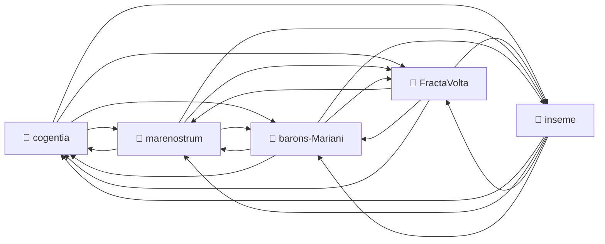

# Corpus Status — inseme

_Auto-refreshed by `cogentia.js corpus-status`. The structural sections_ — _Registered Repositories,
Cross-Reference Graph, Published, What Remains Possible_ — _are regenerated from the registry and
from `research/index.md` on every run._ _The substantive sections_ — _What Is Proved_ _and_ _Open
Objections_ — _are manually curated and preserved across refreshes._

---

## Registered Repositories

<!-- BEGIN_AUTO: registered_repos -->

| Repository     | research/index.md | Branch | Last commit |
| -------------- | ----------------- | ------ | ----------- |
| cogentia       | ✅                | main   | 2026-05-13  |
| FractaVolta    | ✅                | main   | 2026-05-13  |
| marenostrum    | ✅                | main   | 2026-05-13  |
| barons-Mariani | ✅                | main   | 2026-05-13  |
| inseme         | ✅                | master | 2026-05-13  |

<!-- END_AUTO: registered_repos -->

---

## Cross-Reference Graph

<!-- BEGIN_AUTO: graph -->

<!-- END_AUTO: graph -->

---

## Published in this repo

<!-- BEGIN_AUTO: published -->

| Title                                                                                                                     | Location  | Date        |
| ------------------------------------------------------------------------------------------------------------------------- | --------- | ----------- |
| [COP — Cognitive Orchestration Protocol (Architecture)](../packages/cop-core/Architecture.md) _(canonical protocol spec)_ | this repo | 2025-12     |
| [COP Invariants — non-negotiable rules of the protocol](../packages/cop-core/Invariants.md)                               | this repo | 2025-12     |
| [COP Manifesto](../packages/cop-core/Manifesto.md)                                                                        | this repo | 2025-12     |
| [COP FAQ](../packages/cop-core/FAQ.md)                                                                                    | this repo | 2025-12     |
| [COP Comparison with other orchestration frameworks](../packages/cop-core/COMPARISON.md)                                  | this repo | 2025-12     |
| [COP Roadmap](../packages/cop-core/ROADMAP.md)                                                                            | this repo | 2025-12     |
| [Modular System Architecture — the Brique pattern](../docs/MODULAR_SYSTEM.md)                                             | this repo | 2025-12     |
| [BRIQUE_SPEC — the brique manifest contract](../packages/cop-host/BRIQUE_SPEC.md)                                         | this repo | 2025-12     |
| [Multi-Instance Architecture](../packages/cop-host/docs/MULTI_INSTANCE.md)                                                | this repo | 2025-12     |
| [Corpus Status](corpus-status.md) _(living view — auto-refreshed by `cogentia.js corpus-status`)_                         | this repo | refreshable |

<!-- END_AUTO: published -->

---

## What Is Proved

_Manually curated: claims demonstrated by the published work in this corpus._

| Claim               | Status | Evidence |
| ------------------- | ------ | -------- |
| _(add claims here)_ |        |          |

---

## Open Objections

_Manually curated: objections received publicly, not yet fully resolved._

| Objection               | Source | Status |
| ----------------------- | ------ | ------ |
| _(add objections here)_ |        |        |

---

## What Remains Possible

<!-- BEGIN_AUTO: possibilities -->

- A formal "brique developer guide" consolidating BRIQUE_SPEC + concrete examples from
- An "Ophélia mediator profile" — operational semantics of the AI mediator as it interfaces with
- A `brique-` template generator (`cogentia.js init-brique <name>` or equivalent).
<!-- END_AUTO: possibilities -->

---

_Generated with `cogentia.js corpus-status` —
[scripts/cogentia.js](https://github.com/JeanHuguesRobert/cogentia/blob/main/scripts/cogentia.js)_
_Challenge via issues. Fork to explore alternatives._
